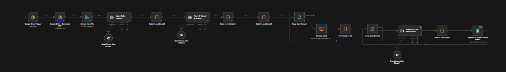

# ai-jobs-n8n
AI-powered job matching automation using n8n, LLMs and web scraping

# AI Job Matching Automation (n8n)

This project presents an advanced AI-powered automation system built with n8n.

The system analyzes candidate resumes, identifies relevant professional roles, searches job opportunities, and evaluates job fit using LLM-based agents.

This repository is intended for demonstration purposes only and does not include the executable workflow or sensitive configurations.

## Overview

The system automates the end-to-end process of matching candidates to relevant job opportunities.

It combines resume parsing, role classification, job scraping, and AI-based scoring into a single automated pipeline.

The goal is to reduce manual job searching and provide structured, ranked job recommendations.

## System Flow

1. A resume is uploaded to Google Drive
2. The system extracts raw text from the PDF
3. AI Agent #1 converts the resume into structured candidate data
4. AI Agent #2 identifies suitable roles and seniority levels
5. The system generates LinkedIn job search queries
6. Duplicate roles are removed to optimize search coverage
7. Jobs are scraped using an external scraping service
8. Jobs are processed in batches to optimize performance and cost
9. AI Agent #3 evaluates each job against the candidate profile
10. Results are written into a structured Google Sheets dataset

## AI Architecture

The system is based on multiple specialized AI agents:

### Resume Parsing Agent
Extracts structured data from raw resume text:
- Skills (programming, tools, domain knowledge)
- Education
- Work experience
- Domain-level experience aggregation

### Career Strategy Agent
Determines realistic roles based on actual experience:
- Uses past job titles as the primary signal
- Calculates years of experience per role
- Assigns seniority levels

### Job Matching Agent
Evaluates job fit using a structured scoring framework:
- Role relevance
- Skills alignment
- Experience gap
- Industry match
- Seniority compatibility

  ## Scoring Framework

Each job is evaluated using a 0–100 scoring model:

- Role and functional fit: 30%
- Skills match: 30%
- Experience requirement: 20%
- Industry alignment: 10%
- Seniority fit: 10%

The system enforces strict constraints:
- Missing mandatory requirements leads to a score of 0
- Only explicit data is used (no hallucination)

  ## Key Features

- End-to-end automation from resume to job recommendations
- Multi-agent AI architecture
- Structured resume parsing
- Role-based job search generation
- Duplicate role filtering
- Batch processing for scalability
- AI-driven job scoring
- Integration with external data sources

## Design Decisions

- Separation of responsibilities between AI agents improves accuracy
- Batch processing reduces token usage and improves efficiency
- Role normalization prevents redundant job searches
- Structured JSON outputs ensure consistent downstream processing

## Notes

This repository intentionally does not include:
- Workflow export files
- API credentials
- Scraping configurations
- Deployment setup

The project is presented for architectural and conceptual demonstration purposes only.

## Workflow Overview

